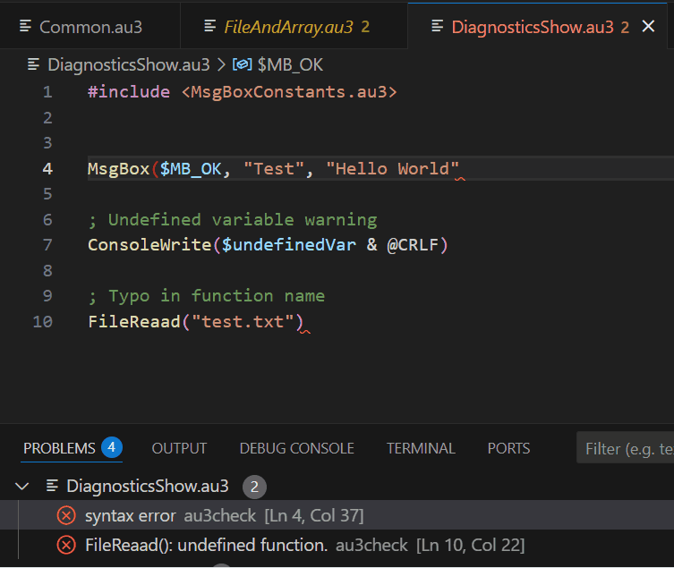

# AutoIt for Visual Studio Code

[](https://marketplace.visualstudio.com/items?itemName=Damien.autoit)
[](https://marketplace.visualstudio.com/items?itemName=Damien.autoit)
[](https://marketplace.visualstudio.com/items?itemName=Damien.autoit)
[](https://github.com/loganch/AutoIt-VSCode)

A comprehensive AutoIt language extension for Visual Studio Code, providing syntax highlighting, IntelliSense, diagnostics, and integrated script execution.

> This extension has been forked and developed from Damien122's original release.

**Quick Links:** [Installation](#installation) | [Features](#features) | [Quick Start](#quick-start) | [Configuration](#configuration) | [Keyboard Shortcuts](#keyboard-shortcuts) | [Platform Support](#platform-support) | [Troubleshooting](#troubleshooting) | [Contributing](#contributing) | [Contributors](#contributors)

---

## Installation

1. Open Visual Studio Code
2. Press `Ctrl+Shift+X` to open Extensions view
3. Search for "AutoIt"
4. Click **Install** on the AutoIt extension by Damien
5. Reload VSCode when prompted

**Prerequisites:**

- [AutoIt3](https://www.autoitscript.com/site/autoit/downloads/) installed on your system
- [SciTE4AutoIt3](https://www.autoitscript.com/site/autoit-script-editor/downloads/) (full install) for compile/build features

---

## Quick Start

1. **Install AutoIt** (if not already installed)
2. **Open an AutoIt script** (.au3 file) in VSCode
3. **Press F5** to run your script
4. **Press Ctrl+F1** with cursor on a function to open AutoIt Help

For non-default AutoIt installations, configure the path in settings:

- Open Command Palette (`Ctrl+Shift+P`)
- Search for "Preferences: Open User Settings"
- Search for "autoit.aiPath"
- Set the full path to your AutoIt3.exe

---

## Features

### IntelliSense & Code Completion

Smart code completion for AutoIt functions, keywords, macros, constants, and variables.


### Symbol Navigation

Quickly navigate to functions, variables, and regions within your script using `Ctrl+Shift+O`.


### Diagnostics & Error Checking

Real-time syntax checking and error detection using Au3Check, displayed in the Problems tab.



### Script Execution & Building

- Run scripts directly from VSCode (F5)
- Compile scripts to executables (Ctrl+F7)
- Build scripts with AutoIt3Wrapper (F7)
- Check syntax with Au3Check (Ctrl+F5)

### Integrated AutoIt Tools

Launch AutoIt tools directly from VSCode:

- AutoIt3 Help (Ctrl+F1)
- Au3Info Window Info Tool (Ctrl+F6)
- Koda Form Designer (Alt+M)

### Go to Definition

Jump to variable and function declarations using F12, or peek definitions with Alt+F12.

### Debug Helpers

- Insert debug MsgBox for selected variable (Ctrl+Shift+D)
- Insert debug ConsoleWrite (Alt+D)

### Code Formatting

Format AutoIt code using Tidy.exe (Windows only, requires SciTE4AutoIt3).

### Include File Management

Open include files at cursor position with Alt+I, with support for custom include paths.

### Multi-Output Panels

Run multiple scripts simultaneously with separate output panels for each.

---

## Platform Support

This extension works on **Windows, macOS, and Linux**, with the following considerations:

| Feature | Windows | macOS/Linux |
|---------|---------|-------------|
| Syntax Highlighting | ✓ | ✓ |
| IntelliSense | ✓ | ✓ |
| Symbol Navigation | ✓ | ✓ |
| Go to Definition | ✓ | ✓ |
| **Run Scripts** | ✓ | **Windows only** |
| **Diagnostics (Au3Check)** | ✓ | **Windows only** |
| **Code Formatting (Tidy)** | ✓ | **Windows only** |
| **Compile/Build** | ✓ | **Windows only** |

> **Note:** AutoIt itself is a Windows automation language. While the extension provides language support on all platforms, script execution and AutoIt tools require a Windows environment.

---

## Configuration

### Essential Settings

Configure the extension via `File → Preferences → Settings` or `Ctrl+,`, then search for "AutoIt":


| Setting | Description | Default |
|---------|-------------|---------|
| `autoit.aiPath` | Path to AutoIt3.exe | `C:\Program Files (x86)\AutoIt3\AutoIt3.exe` |
| `autoit.includePaths` | Additional include folder paths | `[]` |
| `autoit.enableDiagnostics` | Enable Au3Check diagnostics | `true` |
| `autoit.multiOutput` | Separate output panel per script | `true` |

### All Configuration Options

<details>
<summary>Click to expand full configuration table</summary>

| Config | Description | Default |
|--------|-------------|---------|
| `autoit.aiPath` | Full path to AutoIt3.exe | `C:\Program Files (x86)\AutoIt3\AutoIt3.exe` |
| `autoit.wrapperPath` | Full or relative path to AutoIt3Wrapper.au3. Leave blank for default relative to aiPath. | `""` |
| `autoit.checkPath` | Full or relative path to Au3Check.exe. Leave blank for default relative to aiPath. | `""` |
| `autoit.helpPath` | Full or relative path to AutoIt3Help.exe. Leave blank for default relative to aiPath. | `""` |
| `autoit.infoPath` | Full or relative path to Au3Info.exe. Leave blank for default relative to aiPath. | `""` |
| `autoit.kodaPath` | Full or relative path to Koda FormDesigner (FD.exe). Leave blank for default relative to aiPath. | `""` |
| `autoit.includePaths` | Additional include folder paths for IntelliSense | `[]` |
| `autoit.smartHelp` | Define prefixes, paths & sources for custom UDF help files | `{ "__yourUdfFuncPrefix__": { "chmPath": "", "udfPath": [""] } }` |
| **Symbol Navigation** | | |
| `autoit.showVariablesInGoToSymbol` | Show variables in symbol search (Ctrl+Shift+O) | `true` |
| `autoit.showRegionsInGoToSymbol` | Show regions in symbol search (Ctrl+Shift+O) | `true` |
| `autoit.workspaceSymbolMaxFiles` | Max files to process for workspace symbol search | `500` |
| `autoit.workspaceSymbolBatchSize` | Files per batch when building symbol index | `10` |
| `autoit.symbolMaxLines` | Max lines to process for symbols in a single file | `50000` |
| **Diagnostics** | | |
| `autoit.enableDiagnostics` | Provide Au3Check diagnostics on open/save | `true` |
| **Script Execution** | | |
| `autoit.consoleParams` | Parameters passed to console on Run Script | `""` |
| `autoit.terminateRunningOnClose` | Terminate script when file is closed | `true` |
| **Output Panels** | | |
| `autoit.multiOutput` | Separate output panel for each script | `true` |
| `autoit.multiOutputReuseOutput` | Reuse output panel for the same file | `false` |
| `autoit.multiOutputMaxFinished` | Output panels to keep after script finishes | `2` |
| `autoit.multiOutputFinishedTimeout` | Seconds until finished output panels are discarded (0 = indefinitely) | `0` |
| `autoit.clearOutput` | Clear output before each run (when multiOutput is disabled or multiOutputReuseOutput is enabled) | `true` |
| `autoit.multiOutputShowProcessId` | Show process ID in AutoIt output | `"Single"` |
| `autoit.outputCodePage` | System code page for output encoding (if text appears garbled) | `""` |
| `autoit.outputShowTime` | Show timestamp for each output line | `"None"` |
| `autoit.outputMaxHistoryLines` | Number of output lines to keep | `5000` |
| **IntelliSense** | | |
| `autoit.enableParenTriggerForFunctions` | Use `(` to select function completion, add parens, and trigger signature help. Requires reload. | `true` |
| **Code Authoring** | | |
| `autoit.UDFCreator` | Author name for Insert Function Header command | `"Your Name"` |

</details>

---

## Keyboard Shortcuts

### Script Execution & Building

| Shortcut | Command |
|----------|---------|
| `F5` | Run Script |
| `Ctrl+F5` | AutoIt Check (Syntax Check) |
| `F7` | Build Script (AutoIt3Wrapper) |
| `Ctrl+F7` | Compile Script |
| `Shift+F8` | Set Command Line Parameters |
| `Ctrl+Pause/Break` | Kill Running Script |

### Debugging

| Shortcut | Command |
|----------|---------|
| `Ctrl+Shift+D` | Debug to MsgBox |
| `Alt+D` | Debug to Console |
| `Ctrl+Alt+z` | Debug Remove Lines |

### Navigation & Help

| Shortcut | Command |
|----------|---------|
| `F12` | Go to Definition |
| `Alt+F12` | Peek Definition |
| `Ctrl+Shift+O` | Go to Symbol in File |
| `Ctrl+F1` | Open AutoIt Help |
| `Alt+I` | Open Include File |

### Tools

| Shortcut | Command |
|----------|---------|
| `Ctrl+F6` | Launch Au3Info |
| `Alt+M` | Launch Koda Form Designer |

### Code Editing

| Shortcut | Command |
|----------|---------|
| `Ctrl+Alt+H` | Insert UDF Header |

---

## Troubleshooting

### Common Issues

#### Extension features don't work / "AutoIt3.exe not found"

Configure `autoit.aiPath` in settings to point to your AutoIt installation:

```json
"autoit.aiPath": "C:\\Program Files (x86)\\AutoIt3\\AutoIt3.exe"
```

#### Compile and Build commands don't work

These features require the full [SciTE4AutoIt3](https://www.autoitscript.com/site/autoit-script-editor/downloads/) installation, which includes AutoIt3Wrapper and related tools.

#### Diagnostics (error checking) isn't working

Ensure:

1. Au3Check.exe is installed (comes with AutoIt)
2. `autoit.enableDiagnostics` is set to `true`
3. You're on Windows (Au3Check is Windows-only)

#### Output shows garbled/incorrect characters

Set `autoit.outputCodePage` to match your system code page (e.g., `"437"` for US English, `"850"` for Western European).

#### IntelliSense not showing custom UDF functions

Add your UDF include paths to `autoit.includePaths`:

```json
"autoit.includePaths": [
  "C:\\MyAutoItUDFs",
  "C:\\Program Files (x86)\\AutoIt3\\Include"
]
```

#### Keyboard shortcuts conflict with other extensions

Customize keybindings via `File → Preferences → Keyboard Shortcuts` or `Ctrl+K Ctrl+S`.

---

## Contributing

Contributions are welcome!

- **GitHub Repository:** [loganch/AutoIt-VSCode](https://github.com/loganch/AutoIt-VSCode)
- **Report Issues:** [GitHub Issues](https://github.com/loganch/AutoIt-VSCode/issues)
- **Submit Pull Requests:** Fork the repository and submit PRs

Please follow the existing code style and include tests for new features.

---

## Contributors

<a href="https://github.com/loganch/autoit-vscode/graphs/contributors">
  
</a>

Made with [contrib.rocks](https://contrib.rocks).

---

## License

See [LICENSE](LICENSE) file for details.

---

## Changelog

See [CHANGELOG.md](changelog.md) for version history and release notes.

---

**Quick Links:** [Installation](#installation) | [Features](#features) | [Quick Start](#quick-start) | [Configuration](#configuration) | [Keyboard Shortcuts](#keyboard-shortcuts) | [Platform Support](#platform-support) | [Troubleshooting](#troubleshooting) | [Contributing](#contributing) | [Contributors](#contributors)
